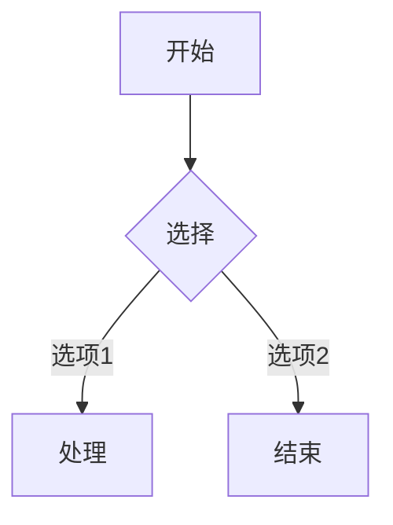

# 功能指南

## 富文本编辑

Muse 提供完整的富文本编辑功能，所有格式化实时可见：

- **文本样式**：加粗 `Ctrl+B`、斜体 `Ctrl+I`、删除线、下划线、高亮
- **标题**：H1-H6 六级标题，支持快捷键 `Ctrl+Alt+1~6`
- **列表**：有序列表、无序列表、任务清单（支持勾选状态）
- **引用**：块引用，支持嵌套引用
- **分割线**：水平分割线
- **表格**：完整表格支持，可插入、删除行列
- **链接**：超链接与锚点跳转
- **图片**：拖拽或粘贴插入图片，自动使用相对路径

## 代码块

支持 190+ 种语言的语法高亮，基于 Lowlight 引擎：

```javascript
function greet(name) {
  return `Hello, ${name}!`
}
```

- 代码块支持行号显示和语言选择器
- 支持代码块内嵌套其他 Markdown 元素
- 一键复制代码内容

## 数学公式

基于 KaTeX 引擎，支持行内公式和块级公式，无需额外配置：

**行内公式**：$E = mc^2$

**块级公式**：

$$
\frac{-b \pm \sqrt{b^2 - 4ac}}{2a}
$$

- 支持 LaTeX 完整语法
- 公式实时渲染，编辑流畅不卡顿

## Mermaid 图表

使用 Mermaid 语法创建流程图、时序图、甘特图等：



- 支持 flowchart、sequenceDiagram、gantt、classDiagram 等多种图表类型
- 图表实时预览，所见即所得

## 图片管理

- **拖拽插入**：直接将图片拖入编辑器，自动转换为相对路径
- **粘贴插入**：从剪贴板粘贴图片，自动保存到当前目录
- **图片预览**：编辑器内直接显示图片，支持调整大小

## 文件管理

- 侧边栏文件树，支持文件夹展开/折叠
- 新建、重命名、删除文件和文件夹
- 右键菜单快捷操作
- 文件变化自动刷新
- 支持多工作区切换

## 主题与导出

- **深色 & 浅色主题**：一键切换，界面元素自动适配
- **格式导出**：支持导出为 HTML、PDF、Word (.docx) 和原始 Markdown
- **打印优化**：导出 PDF 时自动优化排版和分页
- **自定义页眉页脚**：PDF 导出支持自定义页眉页脚内容

## 🔌 插件化扩展系统（v1.1.0 新增）

Muse v1.1.0 引入插件化架构，允许开发者扩展编辑器能力：

- **第三方插件加载**：支持安装社区扩展插件，自定义编辑器功能、工具栏按钮和导出格式
- **扩展 API**：提供完整的扩展开发文档，快速编写并分享自己的插件
- **扩展市场**：内置扩展市场入口，一键安装社区热门扩展

## ☁️ 云端同步预览（v1.1.0 新增）

多设备间实现无缝协作：

- **工作区状态同步**：编辑进度自动保存至云端，切换设备无缝衔接
- **离线编辑**：支持离线模式编辑，联网后自动合并变更
- **实时预览**：多设备间实时同步工作区状态与编辑进度

## 🔍 增强型搜索（v1.1.0 新增）

更强大的全文搜索体验：

- **正则表达式匹配**：全文搜索支持正则表达式，精准定位内容
- **结果高亮**：搜索结果高亮显示上下文行，一目了然
- **快捷唤起**：快捷键 `Ctrl+Shift+F` 快速唤起搜索面板

## ⚡ 性能优化（v1.1.0）

v1.1.0 对性能进行了全面优化：

- **启动速度提升 40%**：冷启动时间缩短至 1s 以内
- **大文件流畅编辑**：10MB+ Markdown 文件编辑流畅度显著改善
- **内存占用降低 30%**：长时间运行更稳定
- **TipTap 实例复用**：减少重复初始化开销
- **文件监听优化**：chokidar 配置调优，降低 CPU 占用
