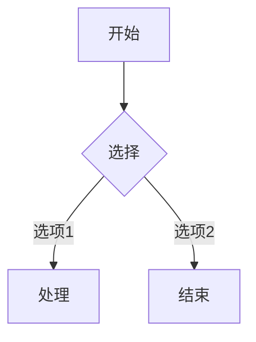

# 功能指南

## 富文本编辑

Muse 提供完整的富文本编辑功能，所有格式化实时可见：

- **文本样式**：加粗 `Ctrl+B`、斜体 `Ctrl+I`、删除线、下划线、高亮
- **标题**：H1-H6 六级标题，支持快捷键 `Ctrl+Alt+1~6`
- **列表**：有序列表、无序列表、任务清单（支持勾选状态）
- **引用**：块引用，支持嵌套引用
- **分割线**：水平分割线
- **表格**：完整表格支持，可插入、删除行列
- **链接**：超链接与锚点跳转
- **图片**：拖拽或粘贴插入图片，自动使用相对路径

## 代码块

支持 190+ 种语言的语法高亮，基于 Lowlight 引擎：

```javascript
function greet(name) {
  return `Hello, ${name}!`
}
```

- 代码块支持行号显示和语言选择器
- 支持代码块内嵌套其他 Markdown 元素
- 一键复制代码内容

## 数学公式

基于 KaTeX 引擎，支持行内公式和块级公式，无需额外配置：

**行内公式**：$E = mc^2$

**块级公式**：

$$
\frac{-b \pm \sqrt{b^2 - 4ac}}{2a}
$$

- 支持 LaTeX 完整语法
- 公式实时渲染，编辑流畅不卡顿

## Mermaid 图表

使用 Mermaid 语法创建流程图、时序图、甘特图等：



- 支持 flowchart、sequenceDiagram、gantt、classDiagram 等多种图表类型
- 图表实时预览，所见即所得

## 图片管理

- **拖拽插入**：直接将图片拖入编辑器，自动转换为相对路径
- **粘贴插入**：从剪贴板粘贴图片，自动保存到当前目录
- **图片预览**：编辑器内直接显示图片，支持调整大小

## 文件管理

- 侧边栏文件树，支持文件夹展开/折叠
- 新建、重命名、删除文件和文件夹
- 右键菜单快捷操作
- 文件变化自动刷新
- 支持多工作区切换

## 主题与导出

- **深色 & 浅色主题**：一键切换，界面元素自动适配
- **格式导出**：支持导出为 HTML、PDF 和原始 Markdown
- **打印优化**：导出 PDF 时自动优化排版和分页
